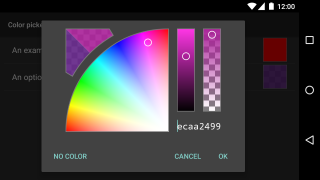
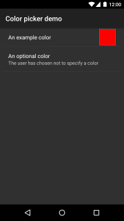

# HSV-Alpha Color Picker for Android

This library implements a color picker and a color preference for use in Android applications.

  

## Features

I couldn't find this combination of features in an existing library, which is why I wrote this one:

* Alpha slider.
* Text field to copy and paste hex color values.
* Old and new colors displayed side by side.
* Optional selection of "no color".
* Proper behavior when orientation changes.
* Up-to-date design.

In addition, the Hue-Saturation picker...

* gives higher hue precision than a square picker of the same size.
* allows easier selection of pure white than a circular picker.

## Using the Library

Add the library dependency to your app module's *build.gradle*:
```groovy
    dependencies {
        compile 'com.rarepebble:colorpicker:1.6.0'
    }
```
Add *jcenter()* to your repository list if it isn't there already.

## ColorPreference Usage

Add the *ColorPreference* to your preference screen xml. Don't forget the extra *xmlns:* declaration:
```xml
    <PreferenceScreen
        xmlns:android="http://schemas.android.com/apk/res/android"
        xmlns:app="http://schemas.android.com/apk/res-auto">

        <com.rarepebble.colorpicker.ColorPreference
            android:key="simplePreference"
            android:title="@string/pref_title"
            app:colorpicker_defaultColor="#f00"
            />

    </PreferenceScreen>
```
To use the "optional color" functionality, specify a button label for the "no color" button:
```xml
        <com.rarepebble.colorpicker.ColorPreference
            android:key="myOptionalColor"
            android:title="@string/pref_optional_color"
            app:colorpicker_selectNoneButtonText="@string/no_color"
            app:colorpicker_noneSelectedSummaryText="@string/no_color_selected"
            />
```
You can also specify some summary text to be shown when there is no color chosen, as in the example
here. The "No color" choice is saved by removing the saved preference, so use
*SharedPreference.contains("myOptionalColor")* to test for that.

To omit the alpha slider or the hex text field, set the optional *colorpicker_showAlpha* or
*colorpicker_showHex* attributes on the color preference.

## ColorPickerView Usage

For many people, the *ColorPreference* will be all that's needed, but if you wish to use the
*ColorPickerView* directly, it can be constructed in the usual way, either in code or in a layout.
Set the initial color with *setColor()* and retrieve the view's current color with *getColor()*:
```java
    final ColorPickerView picker = new ColorPickerView(getContext());
    picker.setColor(0xff12345);
    ...
    final int color = picker.getColor();
```
If you wish to set the initial color and current color independently, use *setOriginalColor()* and
*setCurrentColor()* functions.

Refer to the [ColorPreference source](colorpicker/src/main/java/com/rarepebble/colorpicker/ColorPreference.java?ts=4)
for a fuller example.

To hide the alpha or hex edit fields, use the *showAlpha()* or *showHex()* functions, or use the
*colorpicker_showAlpha* and *colorpicker_showHex* attributes in XML.

## Bugs

Please report bugs in the GitHub issue tracker.

## License

Licensed under the Apache License, Version 2.0 (the "License");
you may not use this file except in compliance with the License.
You may obtain a copy of the License at

http://www.apache.org/licenses/LICENSE-2.0

Unless required by applicable law or agreed to in writing, software
distributed under the License is distributed on an "AS IS" BASIS,
WITHOUT WARRANTIES OR CONDITIONS OF ANY KIND, either express or implied.
See the License for the specific language governing permissions and
limitations under the License.
